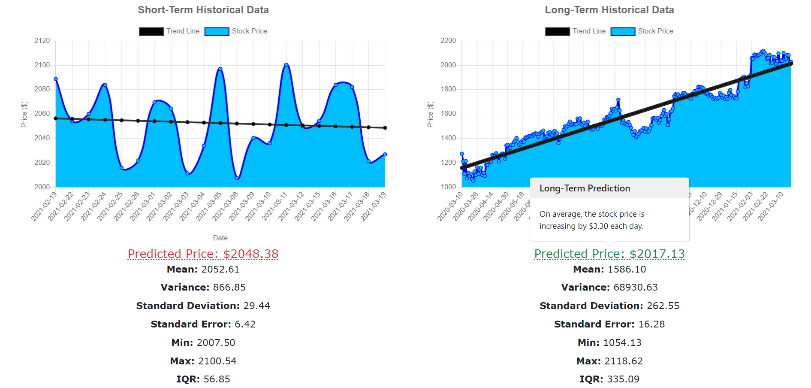
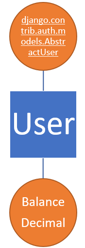
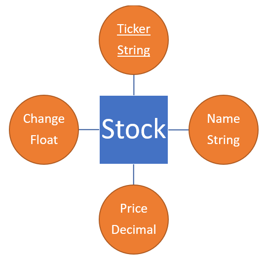
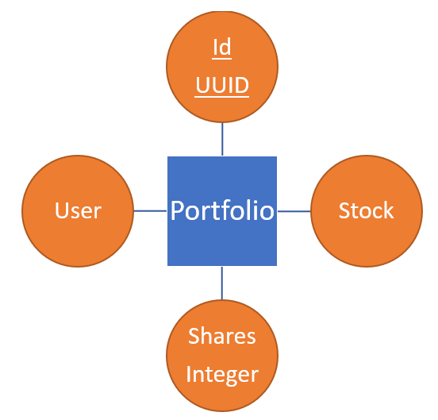
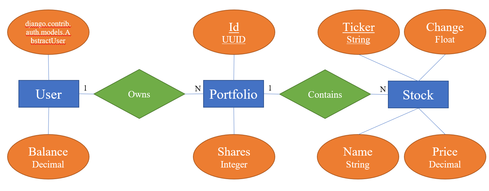

# How to Stock

[](https://github.com/Abhiek187/how-to-stock/actions/workflows/django.yml)
[](https://github.com/Abhiek187/how-to-stock/actions/workflows/codeql-analysis.yml)



This web service serves as an introduction to the stock market for users new to finance. Users can learn about various financial terms, simulate trading stocks using a virtual balance, and view stock predictions based on probability and statistical data.

## Models

4 models are used: User, Stock, Portfolio, and Card. The database was designed to satisfy the three normal forms. The following diagrams summarize each model (using [Chen Notation](https://vertabelo.com/blog/chen-erd-notation/)):

### User



The User model extends Django's AbstractUser model for authenticating users. The default user model contains fields like username, email, and password (hashed). An additional field—balance—was added to save the user's balance when they log in.

### Stock



The Stock model contains information about each stock. The ticker uniquely identifies each stock. The price and change fields are updated whenever the user views their portfolio.

### Portfolio



The Portfolio model contains the number of shares the user owns of each stock. In addition, it contains two foreign keys referencing the user and stock model. Those models combined form the following diagram:



Portfolio exibits a many-to-one relationship with User and a one-to-many relationship with Stock. This way, one user can own multiple stocks, and multiple users can own the same stock. If the user removes their account, their portfolio goes with them. But if they sell all of a stock, the stock information remains in the Stock object for future trades.

### Card


The Card model contains the word and definition for every financial term used throughout the app. Besides displaying them as flashcards, some words are used in other views and their definition can be displayed through a popover.

## Views

The app is split up into 4 sections:

- **Screener:** This is where users can filter stocks by country, price, sector, and exchange.

- **Flashcards:** Users can view a list of financial terms used throughout the app.

- **Portfolio:** Users can view a list of stocks they've invested in. They start off with $10,000 and can view how their net worth changes each day.

- **Details:** This page shows stock information about a company as well as a detailed analysis of the stock price for short and long-term investments. This is also where users can trade stocks.

The app also features an authentication system so users can save their portfolio and balance whenever they're logged in. Logging in is required for the Portfolio and Details view. Using session cookies, the users' sessions can last up to 2 weeks.

## Dependencies

The front-end is created in HTML, CSS, & JS and the back-end is created in [Django](https://docs.djangoproject.com/en/3.1/) and utilizes an SQLite database. [Bootstrap](https://getbootstrap.com/) was used to enhance the site's design and implement UI elements such as alerts and popovers. [Chart.js](https://www.chartjs.org/) was used to visualize the stock trends on the details page. And [Financial Modeling Prep](https://financialmodelingprep.com/developer/docs/) was the API used to implement the screener functionality and obtain detailed profiles and stock history from all the companies. Above everything else, this web app is designed to be responsive, accessible, and thoroughly tested.

## How to Run

### Fly.io

This project is hosted live at Fly.io and can be accessed directly at [https://how-to-stock-3.fly.dev](https://how-to-stock-3.fly.dev). No installation required.

### Manual

Before cloning this repo, you will need to obtain an API key from [Financial Modeling Prep](https://financialmodelingprep.com/developer/docs/). Then do the following:

1. Create a virtual environment, install all dependencies, save the API key, and run the Django server: `./start-local.sh YOUR_API_KEY` or `source start-local.sh YOUR_API_KEY` (See step 3 for the differences.) On future visits, the API key doesn't need to be provided.
2. Open `localhost:8000` in your browser.
3. When done, press `CTRL/CMD-C` to stop the Django server. If you used `./start-local.sh`, you will return to your current shell. But if you used `source start-local.sh`, you will need to deactivate the virtual environment: `deactivate`

### Docker

Make sure [Docker](https://www.docker.com/products/docker-desktop) and [Docker Compose](https://docs.docker.com/compose/install/) are installed. And make sure to obtain an API key from [Financial Modeling Prep](https://financialmodelingprep.com/developer/docs/). Then do the following:

1. Pass in the API key and start up a container for this app: `./start-docker.sh YOUR_API_KEY`. On future visits, the container can be spun up directly using `./start-docker.sh` or `docker-compose up -d`.
2. Once everything's installed, open `localhost:8000` in your browser.
3. When done, shut down and clean up the container: `docker-compose down`

## Troubleshooting

### GitHub Actions

When making a request to FMP for the first time in GitHub Actions, the requests may fail with the following response:

```html
<html>
  <head>
    <title>403 Forbidden</title>
  </head>
  <body bgcolor="white">
    <center><h1>403 Forbidden</h1></center>
    <hr />
    <center>nginx/1.14.0 (Ubuntu)</center>
  </body>
</html>
```

This error goes away after re-running the jobs.

### Fly.io

If the Postgres database is down, run the following commands to restart the machine:

```bash
fly machines list -a how-to-stock-3-db
fly machines start MACHINE_ID -a how-to-stock-3-db
```
