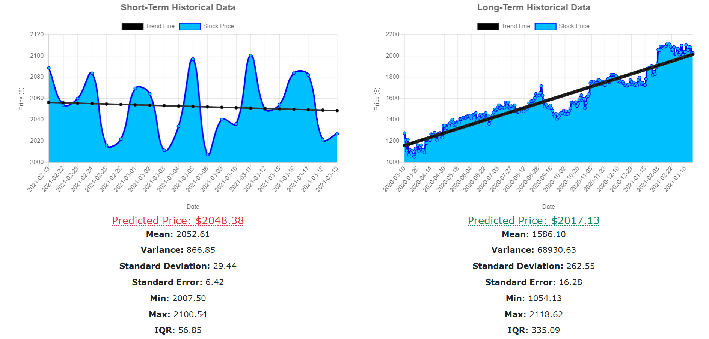

# How to Stock

This web service serves as an introduction to the stock market for users new to finance. Users can learn about various financial terms, simulate trading stocks using a virtual balance, and view stock predictions based on probability and statistical data.

## Features

The app is split up into 4 sections:

-   **Screener:** This is where users can filter stocks by country, price, sector, and exchange.

-   **Flashcards:** Users can view a list of financial terms used throughout the app.

-   **Portfolio:** Users can view a list of stocks they've invested in. They start off with $10,000 and can view how their net worth changes each day.

-   **Details:** This page shows stock information about a company as well as a detailed analysis of the stock price for short and long-term investments. This is also where users can trade stocks.

The app also features an authentication system so users can save their portfolio and balance whenever they're logged in. Logging in is required for the Portfolio and Details view. SSO is implemented, so users' sessions can last up to 2 weeks.

## Dependencies

The front-end is created in HTML, CSS, & JS and the back-end is created in [Django](https://docs.djangoproject.com/en/3.1/) and utilizes an SQLite database. [Bootstrap](https://getbootstrap.com/) was used to enhance the site's design and implement UI elements such as alerts and popovers. [Chart.js](https://www.chartjs.org/) was used to visualize the stock trends on the details page. And [Financial Modeling Prep](https://financialmodelingprep.com/developer/docs/) was the API used to implement the screener functionality and obtain detailed profiles and stock history from all the companies. Above everything else, this web app is designed to be responsive, accessible, and thoroughly tested.

## How to Run

### Manual

After cloning this repo, run the following:

1. Create a virtual environment, install all dependencies, and run the Django server: `./start.sh` or `source start.sh` (See step 3 for the differences.)
2. Open `localhost:8000/stockapp` in your browser.
3. When done, press `CTRL/CMD-C` to stop the Django server. If you used `./start.sh`, you will return to your current shell. But if you used `source start.sh`, you will need to deactivate the virtual environment: `deactivate`

### Docker

Make sure [Docker](https://www.docker.com/products/docker-desktop) and [Docker Compose](https://docs.docker.com/compose/install/) are installed. Then run the following:

1. Start up a container for this app: `docker-compose up -d`
2. Once everything's installed, open `localhost:8000/stockapp` in your browser.
3. When done, shut down and clean up the container: `docker-compose down`
